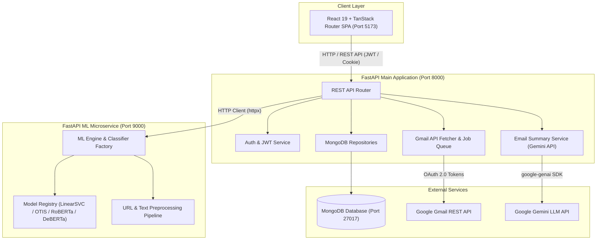
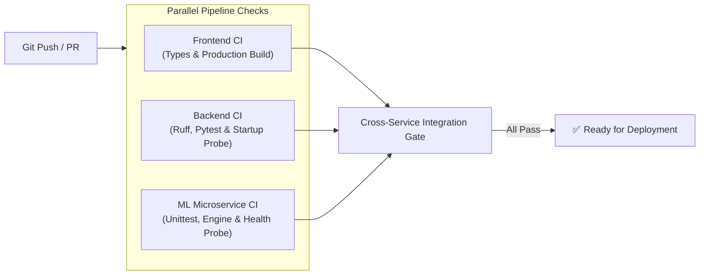

# 🛡️ MailSentry

[](https://github.com/khushal910/MailSentry/actions/workflows/ci.yml)
[](LICENSE)
[](https://www.python.org/)
[](https://nodejs.org/)
[](https://fastapi.tiangolo.com/)
[](https://react.dev/)

**MailSentry** is an end-to-end, enterprise-grade intelligent email security and processing platform. Built using a decoupled microservices architecture, MailSentry connects directly to user Gmail accounts via OAuth 2.0, ingests unclassified incoming messages, applies machine learning models (ranging from lightweight Scikit-Learn pipelines to fine-tuned Hugging Face transformers), and generates AI email summaries powered by Google Gemini.

---

## 📋 Table of Contents

- [Overview & Roadmap Status](#-overview--roadmap-status)
- [System Architecture](#-system-architecture)
- [Key Features](#-key-features)
- [Machine Learning & AI Infrastructure](#-machine-learning--ai-infrastructure)
- [Technology Stack](#-technology-stack)
- [Project Structure](#-project-structure)
- [Prerequisites](#-prerequisites)
- [Step-by-Step Installation Guide](#-step-by-step-installation-guide)
- [Environment Variables](#-environment-variables)
- [Running MailSentry Locally](#-running-mailsentry-locally)
- [Health Checks & Monitoring](#-health-checks--monitoring)
- [API Overview & Documentation](#-api-overview--documentation)
- [Email Processing Pipeline](#-email-processing-pipeline)
- [Database Schema & Architecture](#-database-schema--architecture)
- [Testing & Quality Assurance](#-testing--quality-assurance)
- [CI/CD Pipeline](#-cicd-pipeline)
- [Production Deployment](#-production-deployment)
- [Security Practices](#-security-practices)
- [Troubleshooting](#-troubleshooting)
- [MLOps & Model Training Pipeline](#-mlops--model-training-pipeline)
- [FAQ](#-faq)
- [Contribution & License](#-contribution--license)

---

## 🎯 Overview & Roadmap Status

MailSentry solves inbox overload and security vulnerability by automating email classification and intelligence.

### Implementation Evolution

| Phase | Feature | Status | Implementation Details |
| :--- | :--- | :--- | :--- |
| **Phase 1** | **Spam & Security Email Classification** | ✅ **Implemented** | Async background jobs, real-time job status polling, multi-model support (`LinearSVC`, `OTIS`, `RoBERTa`, `DeBERTa-v3`). |
| **Phase 2** | **Email Ranking & Prioritization** | ⏳ *Planned* | Marked on project roadmap for future release. |
| **Phase 3** | **AI Email Summarization** | ✅ **Implemented** | Powered by Google Gemini API (`google-genai` SDK) via `EmailSummaryService` with MongoDB lazy caching. |
| **Phase 4** | **Automated Meeting Scheduling** | ⏳ *Early API Stub* | Initial verification endpoint (`POST /api/gmail/schedule-meeting`) available; automated calendar event creation is on the roadmap. |

---

## 🏗️ System Architecture

MailSentry is built around three independent services communicating asynchronously over HTTP REST APIs:



---

## ✨ Key Features

### 1. Authentication & User Security
- **Email & Password Authentication**: Account creation with password policy options (`/auth/register`, `/auth/login`).
- **Secure Token Delivery**: Supports JWTs delivered in HttpOnly, SameSite cookies or Bearer Authorization headers.
- **OTP Password Reset**: Two-step email OTP verification (`/auth/forgot-password`, `/auth/verify-reset-otp`, `/auth/reset-password`).
- **User Profile Management**: Update avatar, full name, phone number, bio, and password (`/api/profile`).
- **Maintenance Mode**: Global system maintenance toggle with admin whitelist bypass (`MAINTENANCE_ADMIN_EMAILS`).

### 2. Gmail OAuth Integration & Asynchronous Queue
- **Google OAuth 2.0**: Connect Gmail account with scopes (`gmail.readonly`, `gmail.modify`, `userinfo.email`).
- **Raw Email Queueing**: Fetches unclassified emails without modifying Gmail state (`/api/gmail/fetch-unclassified`).
- **Async Classification Jobs**: Spawns background worker tasks (`/api/gmail/classify-job`), providing real-time progress polling (`/api/gmail/jobs/{job_id}`).
- **Direct Gmail Deep-Links**: UI buttons link directly to individual Gmail messages (`https://mail.google.com/mail/u/0/#inbox/{message_id}`).

### 3. Machine Learning Spam Classification
- **Multi-Model Support**: Supports Scikit-Learn pipelines and deep-learning transformer architectures via `CLASSIFICATION_MODEL` environment variable.
- **Microservice Isolation**: Heavy ML inference runs on an independent port (9000) to keep the backend core responsive.
- **Resilient Fallback**: Built-in fallback to local Scikit-Learn models if the ML microservice is unreachable.

### 4. AI Email Summarization
- **Lazy Summary Generation**: Summarizes email text using Google Gemini API (`google-genai`).
- **MongoDB Caching**: Generated summaries are cached directly inside the MongoDB `emails` collection to prevent redundant API calls.

### 5. Production Model Management & Analytics
- **Live Model Inspection**: View current model metrics (accuracy, precision, recall, F1, ROC-AUC, inference latency).
- **Hot Switching**: Dynamically switch the active classification engine without restarting the main server.
- **Analytics Dashboard**: Aggregated stats showing spam percentages, classification history, and confidence distributions.

---

## 🤖 Machine Learning & AI Infrastructure

MailSentry uses the **Kaggle Spam Email Dataset** ([Dataset Link](https://www.kaggle.com/datasets/willyard/spam-email-dataset)) for training base models, combined with custom feature engineering.

### Supported Machine Learning Models

```
                                MailSentry Model Family
                                          │
       ┌──────────────────────────────────┴──────────────────────────────────┐
       │                                                                     │
Scikit-Learn Pipeline                                           Hugging Face Transformers
 ├── LinearSVC + TF-IDF Vectorizer                              ├── OTIS (Titeiiko/OTIS-Official-Spam-Model)
 └── Custom URL Feature Extractor                               ├── RoBERTa-base + LoRA Adapter (r=8)
                                                                └── DeBERTa-v3-base + LoRA Adapter (r=8)
```

| Model Key | Algorithm / Base Model | Adapter / Technology | Metrics (Accuracy / F1) | Size / Latency |
| :--- | :--- | :--- | :--- | :--- |
| `mlops` / `linear_svc` | LinearSVC + TF-IDF | Custom `MLPreprocessing` Pipeline | 98.45% / 98.45% | **0.05 MB** / ~1.75ms |
| `otis` | OTIS Spam Model | `Titeiiko/OTIS-Official-Spam-Model` | 99.20% / 99.17% | **17.00 MB** / ~5.20ms |
| `roberta` | RoBERTa-base | `ssheroz/spam-email-classifier-roberta-r8` (LoRA) | 99.12% / 99.17% | **498.50 MB** / ~12.45ms |
| `deberta-v3-base` | DeBERTa-v3-base | `ssheroz/spam-email-classifier-deberta-v3-base-r8` (LoRA) | 99.35% / 99.35% | **512.00 MB** / ~14.20ms |

### Text Preprocessing & Feature Engineering
- **URL Feature Extractor**: Extracts total URL count, IP-based URLs, suspicious domains, and port numbers.
- **Text Normalizer**: Cleans raw HTML tags, normalizes whitespace, strips email headers, and extracts structural text features.

---

## 🛠️ Technology Stack

| Domain | Technology | Description |
| :--- | :--- | :--- |
| **Frontend** | **React 19.2** | Modern React UI with Concurrent Mode features. |
| | **Vite 8.0** | Ultra-fast frontend build tool and dev server. |
| | **TanStack Router & Query** | Type-safe client routing and server state caching. |
| | **TailwindCSS 4.2** | Utility-first CSS framework with animated design components. |
| | **Axios & Sonner** | HTTP client with automatic cookie handling and toast notifications. |
| **Backend** | **FastAPI 0.104** | High-performance Python web framework. |
| | **Python 3.11** | Core runtime environment. |
| | **PyMongo / Motor** | Asynchronous MongoDB driver. |
| | **Google GenAI SDK** | Gemini API integration for email summarization. |
| | **Passlib & PyJWT** | Bcrypt password hashing and JWT token handling. |
| **ML Service** | **FastAPI & Uvicorn** | Independent ML inference microservice (Port 9000). |
| | **Scikit-Learn & PyTorch** | ML model training and execution engines. |
| | **Hugging Face PEFT** | Parameter-Efficient Fine-Tuning using LoRA adapters. |
| | **MLflow & DagsHub** | MLOps experiment tracking and remote artifact logging. |
| | **DVC** | Data and pipeline version control (`dvc.yaml`). |
| **Database** | **MongoDB 6.0+** | NoSQL document database for users, emails, and job states. |
| **CI / Infra** | **GitHub Actions** | Automated CI matrix (Frontend, Backend, ML Service, Integration Gate). |
| | **Astral uv** | Fast Python package management. |

---

## 📁 Project Structure

```text
MailSentry/
├── backend/                        # FastAPI Main API Server
│   ├── app/
│   │   ├── api/                    # API Route Controllers (auth, gmail, emails, model, profile)
│   │   ├── core/                   # Configuration settings and MongoDB initializers
│   │   ├── dependencies/           # Auth & Google OAuth FastAPI dependency injectors
│   │   ├── middleware/             # Maintenance mode & CORS middleware
│   │   ├── models/                 # Database models and schemas
│   │   ├── repositories/           # MongoDB data access layer
│   │   ├── schemas/                # Pydantic request/response schemas
│   │   ├── services/               # Business logic (email summary, Gmail fetch, ML client)
│   │   └── utils/                  # Helper utilities and custom response formatters
│   ├── models/                     # Production model binary artifacts (.pkl, .joblib)
│   ├── tests/                      # Backend Pytest test suite
│   ├── main.py                     # Entry point for backend server (Port 8000)
│   └── requirements.txt            # Python dependencies for backend
├── frontend/                       # React 19 + Vite Frontend SPA
│   ├── src/
│   │   ├── components/             # Reusable UI components (buttons, badges, transitions)
│   │   ├── context/                # Maintenance & App state contexts
│   │   ├── hooks/                  # Custom React hooks (debounce, auth, pagination)
│   │   ├── routes/                 # TanStack file-based route views (dashboard, auto-classifier, etc.)
│   │   ├── services/               # API clients (apiClient, emailsApi, googleAuthApi)
│   │   └── utils/                  # Formatting & Gmail deep-link helpers
│   ├── package.json                # Node.js dependencies and scripts
│   └── vite.config.ts              # Vite configuration
├── ml-service/                     # Independent ML Inference Microservice
│   ├── app/                        # Inference API service (port 9000)
│   │   ├── api/                    # Classification and health check routes
│   │   ├── core/                   # Model registry and configuration
│   │   └── services/               # Classifier implementations (linear_svc, otis, roberta, deberta)
│   ├── src/                        # MLOps Model Training & DVC Pipeline Source
│   │   ├── components/             # Ingestion, validation, transformation, training components
│   │   ├── configuration/          # MLflow & DagsHub connection initializers
│   │   └── pipeline/               # Training and evaluation execution pipelines
│   ├── tests/                      # ML Microservice test suite
│   ├── install_deps.py             # Dynamic dependency installer (--uv, --cpu, --dev)
│   ├── main.py                     # Entry point for ML microservice (Port 9000)
│   ├── requirements-base.txt       # Production inference lightweight requirements
│   ├── requirements-torch.txt      # PyTorch & HuggingFace optional dependencies
│   ├── requirements-dev.txt        # Local training & MLOps dependencies
│   └── dvc.yaml                    # DVC pipeline pipeline definition
├── .github/
│   └── workflows/
│       └── ci.yml                  # Automated GitHub Actions CI pipeline
├── LICENSE                         # MIT License
└── README.md                       # Project Documentation
```

---

## ⚡ Prerequisites

Before installing and running MailSentry locally, ensure you have the following installed:

- **Git** (`>= 2.30`)
- **Node.js** (`>= 20.x`) & **npm** (`>= 10.x`)
- **Python** (`>= 3.11`)
- **MongoDB Server** (`>= 6.0`) running locally on `mongodb://localhost:27017` (or a MongoDB Atlas connection string)
- **Google Cloud Console OAuth 2.0 Client Credentials** (for Gmail API access)
- **Google Gemini API Key** (optional, for email summarization)

---

## 🛠️ Step-by-Step Installation Guide

### 1. Clone the Repository

```bash
git clone https://github.com/khushal910/MailSentry.git
cd MailSentry
```

### 2. Backend Setup

```bash
cd backend
python -m venv .venv

# On Windows:
.venv\Scripts\activate
# On Linux/macOS:
# source .venv/bin/activate

pip install -r requirements.txt
cp .env.example .env
```

### 3. ML Microservice Setup

```bash
cd ../ml-service
python -m venv .venv

# On Windows:
.venv\Scripts\activate
# On Linux/macOS:
# source .venv/bin/activate

# Install production lightweight dependencies using the installer:
python install_deps.py

# Optional: To install local MLOps training & experiment tracking tools:
# python install_deps.py --dev

cp .example.env .env
```

### 4. Frontend Setup

```bash
cd ../frontend
npm install
```

---

## 🔑 Environment Variables

### 1. Backend (`backend/.env`)

| Variable | Required | Default / Example | Purpose |
| :--- | :---: | :--- | :--- |
| `APP_NAME` | Yes | `MailSentry` | Application display name |
| `SECRET_KEY` | Yes | `your-secret-key-32-chars-min` | JWT signing secret key |
| `MONGO_URI` | Yes | `mongodb://localhost:27017` | MongoDB connection URI |
| `DATABASE_NAME` | Yes | `mailsentry` | Database name |
| `GOOGLE_CLIENT_ID` | Yes | `your-id.apps.googleusercontent.com` | Google OAuth Client ID |
| `GOOGLE_CLIENT_SECRET` | Yes | `your-client-secret` | Google OAuth Client Secret |
| `GOOGLE_REDIRECT_URI` | Yes | `http://localhost:8000/api/v1/gmail/oauth/callback` | OAuth redirect callback URL |
| `ML_SERVICE_URL` | Yes | `http://localhost:9000` | Address of independent ML microservice |
| `FALLBACK_CLASSIFICATION_MODEL`| No | `mlops` | Model used when ML service is offline |
| `GEMINI_API_KEY` | No | `your-gemini-api-key` | Google Gemini API key for summaries |
| `MAINTENANCE_MODE` | No | `false` | Enable application maintenance mode |

### 2. ML Microservice (`ml-service/.env`)

| Variable | Required | Default / Example | Purpose |
| :--- | :---: | :--- | :--- |
| `CLASSIFICATION_MODEL` | Yes | `mlops` | Active model (`mlops`, `otis`, `roberta`, `deberta-v3-base`) |
| `USE_ONNX` | No | `false` | Enable ONNX Runtime acceleration |
| `CORS_ORIGINS` | Yes | `["http://localhost:8000"]` | Allowed origins for cross-origin requests |

### 3. Frontend (`frontend/.env`)

| Variable | Required | Default / Example | Purpose |
| :--- | :---: | :--- | :--- |
| `VITE_API_URL` | Yes | `http://localhost:8000` | Backend API base URL |
| `VITE_API_TIMEOUT` | No | `60000` | API request timeout in milliseconds |

---

## 🚀 Running MailSentry Locally

To run the complete platform, start the components in separate terminal windows:

### Terminal 1: Database
Ensure MongoDB is running locally:
```bash
mongod --dbpath /path/to/data
```

### Terminal 2: ML Microservice (Port 9000)
```bash
cd ml-service
python main.py
```
*Verification*: Open `http://localhost:9000/health` in your browser.

### Terminal 3: Backend API Server (Port 8000)
```bash
cd backend
python main.py
```
*Verification*: Open `http://localhost:8000/health` or `http://localhost:8000/docs` (Swagger UI).

### Terminal 4: Frontend Development Server (Port 5173)
```bash
cd frontend
npm run dev
```
*Access*: Open `http://localhost:5173` in your browser.

### Port Allocation Summary

| Component | Host / Port | Description |
| :--- | :--- | :--- |
| **Frontend UI** | `http://localhost:5173` | React Single Page Application |
| **Backend API** | `http://localhost:8000` | FastAPI Main Server |
| **ML Microservice** | `http://localhost:9000` | Machine Learning Inference Service |
| **MongoDB** | `mongodb://localhost:27017` | Database Engine |

---

## 🏥 Health Checks & Monitoring

MailSentry includes health check probes across services:

- **Backend Health Check**:
  - Endpoint: `GET /health` or `GET /api/health`
  - Response:
    ```json
    {
      "status": "healthy",
      "service": "MailSentry API",
      "version": "1.0.0",
      "database": true
    }
    ```
- **ML Microservice Probes**:
  - Health: `GET /health` (`http://localhost:9000/health`)
  - Metadata Version: `GET /version` (`http://localhost:9000/version`)

---

## 📡 API Overview & Documentation

Interactive API documentation (Swagger UI) is available at `http://localhost:8000/docs` when running the backend.

### Key API Endpoints

#### Authentication (`/auth`)
- `POST /auth/register` — Create a new user account.
- `POST /auth/login` — Authenticate user and issue session token / HttpOnly cookie.
- `POST /auth/logout` — Clear session token / cookie.
- `GET /auth/me` — Get current authenticated user profile.
- `POST /auth/forgot-password` — Send OTP code for password reset.
- `POST /auth/verify-reset-otp` — Validate password reset OTP code.
- `POST /auth/reset-password` — Set new password using verified OTP.

#### Gmail Integration (`/api/gmail`)
- `GET /auth/google/connect` — Initiate Google OAuth 2.0 flow.
- `POST /api/gmail/fetch-unclassified` — Fetch unclassified raw emails from Gmail.
- `POST /api/gmail/classify-job` — Start an asynchronous background classification job.
- `GET /api/gmail/jobs/{job_id}` — Poll background job progress and status.

#### Email Management (`/api/emails`)
- `GET /api/emails` — Get paginated, sanitized prediction records for the user.
- `GET /api/emails/{email_id}/summary` — Fetch or generate AI email summary via Gemini API.

#### Model & Analytics (`/api`)
- `GET /api/dashboard/stats` — Retrieve aggregated classification statistics.
- `GET /api/v1/model/production` — Retrieve active production model specifications and live ML service status.

---

## 🔄 Email Processing Pipeline

```text
Incoming Raw Gmail Message
           │
           ▼
[Fetch Unclassified Queue]  ── (FastAPI Backend / Gmail API)
           │
           ▼
[Start Asynchronous Job]    ── (Returns job_id < 100ms)
           │
           ▼
[Background Worker Thread] ── (Offloads CPU-bound task to thread pool)
           │
           ▼
[Text Preprocessing]        ── (URL extraction & text normalization)
           │
           ▼
[ML Model Inference]        ── (LinearSVC / OTIS / RoBERTa / DeBERTa)
           │
           ▼
[Save to MongoDB]           ── (Store prediction score & timestamp)
           │
           ▼
[Lazy AI Summarization]     ── (Generated via Gemini API on demand)
```

---

## 🗄️ Database Schema & Architecture

MailSentry uses MongoDB with indexes for query performance.

### Core Collections

1. **`users`**: User registration records, hashed passwords (`bcrypt`), and profile details.
2. **`emails`**: Storage for email predictions.
   - Fields: `user_id`, `message_id`, `thread_id`, `subject`, `snippet`, `predicted_label`, `predicted_score`, `gmail_classification`, `summary`, `classified_at`.
3. **`google_accounts`**: Stores Google OAuth 2.0 tokens (access token, refresh token, expiration) linked to user IDs.
4. **`classification_jobs`**: Job status tracking documents for asynchronous multi-worker polling (`job_id`, `status`, `total`, `processed`, `current_subject`).

---

## 🧪 Testing & Quality Assurance

MailSentry maintains test coverage across all microservices:

### 1. Frontend Validation
```bash
cd frontend
npm run test    # Runs TypeScript type-checking (tsc --noEmit)
npm run lint    # Runs ESLint code quality check
```

### 2. Backend Unit & API Tests
Requires local MongoDB or automated CI test container:
```bash
cd backend
pytest tests
```

### 3. ML Microservice Test Suite
```bash
cd ml-service
python -m unittest discover -s tests
```

---

## ⚙️ CI/CD Pipeline

MailSentry utilizes a GitHub Actions workflow (`.github/workflows/ci.yml`) triggered on pushes and pull requests to `main`.



---

## 🌐 Production Deployment

MailSentry is configured for deployment on platforms like **Render**:

- **ML Microservice Deployment**:
  - Environment: Python 3.11
  - Build Command: `python install_deps.py`
  - Start Command: `uvicorn main:app --host 0.0.0.0 --port 9000`
- **Backend Deployment**:
  - Environment: Python 3.11
  - Build Command: `pip install -r requirements.txt`
  - Start Command: `gunicorn main:app -w 2 -k uvicorn.workers.UvicornWorker --bind 0.0.0.0:8000`
- **Frontend Deployment**:
  - Environment: Static Site / Node.js
  - Build Command: `npm run build`
  - Output Directory: `dist`

---

## 🔒 Security Practices

> [!WARNING]
> Never commit `.env` files, API keys, Google OAuth secrets, JWT signing secrets, or database credentials to source control.

- **JWT Security**: Tokens are signed using HS256 algorithm and stored in HttpOnly cookies to defend against XSS attacks.
- **Password Hashing**: User passwords are encrypted using `bcrypt` via `passlib`.
- **OAuth Scope Limitation**: Gmail permissions are restricted to minimal required scopes (`gmail.readonly`, `gmail.modify`).
- **Data Sanitization**: Sensitive database fields (`_id`, tokens, raw bodies) are stripped by backend serializers before returning payloads to the client UI.

---

## 🛠️ Troubleshooting

### 1. Progress Bar / Job Status not working on Render
- **Cause**: Multi-worker isolation in gunicorn caused worker processes to have disconnected in-memory job states.
- **Solution**: MongoDB serves as the source of truth for all job queries (`get_job()`), ensuring status lookups succeed regardless of which worker process handles the poll request.

### 2. Google OAuth Redirect Mismatch
- **Cause**: The `GOOGLE_REDIRECT_URI` set in `.env` does not match the URI configured in Google Cloud Console.
- **Solution**: Ensure `GOOGLE_REDIRECT_URI=http://localhost:8000/api/v1/gmail/oauth/callback` is listed in your Authorized Redirect URIs in Google Cloud Console.

### 3. ML Service Connection Refused
- **Cause**: Backend cannot reach `http://localhost:9000`.
- **Solution**: Ensure `ml-service/main.py` is running on port 9000. If offline, the backend will automatically use its internal Scikit-Learn fallback model.

---

## 🔬 MLOps & Model Training Pipeline

MailSentry uses **DVC** and **MLflow** for dataset versioning and experiment tracking.

To reproduce or run the ML model training pipeline locally:

```bash
cd ml-service
# Install dev training dependencies:
python install_deps.py --dev

# Run DVC pipeline reproduction:
dvc repro
```

Model training runs log parameters, loss curves, and artifact metrics directly to **DagsHub / MLflow**.

---

## ❓ FAQ

#### 1. What is MailSentry?
MailSentry is an intelligent email management platform that automates spam detection, provides AI summaries, and integrates with Gmail.

#### 2. Do I need a Gmail account to test MailSentry?
You can use single email classification without connecting Gmail. Connecting Gmail is required for fetching unclassified inbox queues.

#### 3. How does email classification work?
MailSentry extracts features (text, URLs, structural properties) and feeds them into machine learning models (`LinearSVC` or fine-tuned Hugging Face transformers like `OTIS`, `RoBERTa`, or `DeBERTa`).

#### 4. How does email summarization work?
Email text is sent to Google's Gemini API using the `google-genai` SDK to generate a concise summary, which is cached in MongoDB.

---

## 🤝 Contribution & License

Contributions are welcome! Please follow these steps:
1. Fork the repository.
2. Create a feature branch (`git checkout -b feature/my-feature`).
3. Run tests across frontend, backend, and ML microservice.
4. Commit your changes (`git commit -m 'feat: add new feature'`).
5. Open a Pull Request against `main`.

### License
This project is licensed under the [MIT License](LICENSE).
