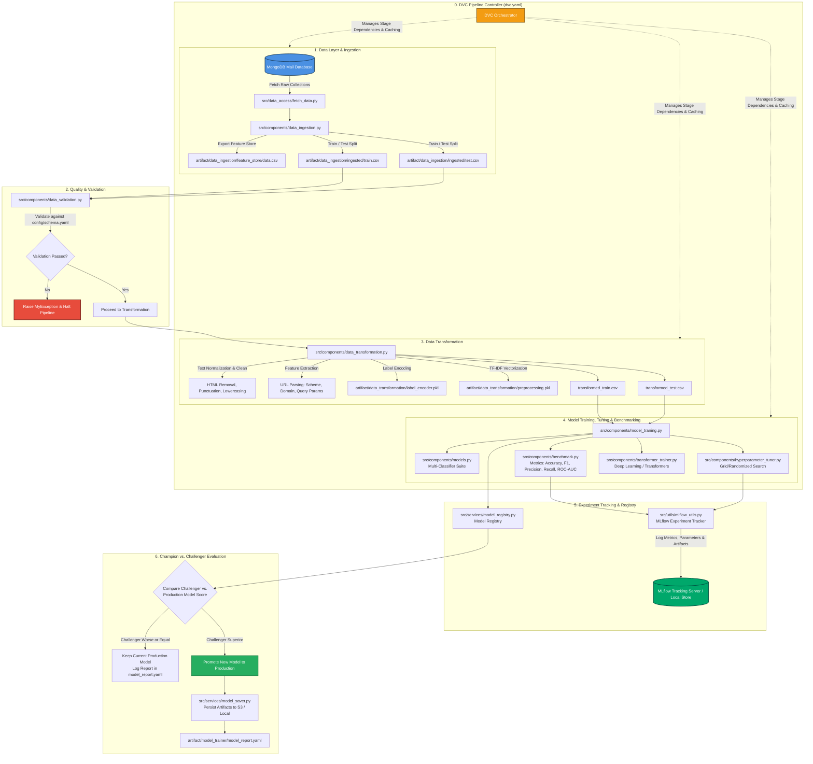

# MailSentry ML-Service Pipeline: Orchestration & Architectural Documentation

## Executive Overview

The `ml-service` module in **MailSentry** is an end-to-end, reproducible, and enterprise-grade Machine Learning pipeline designed for automated email classification (Spam, Ham, and Phishing detection). It encompasses every phase of the MLOps lifecycle: raw data ingestion from document stores, rigorous schema validation, NLP text cleaning and feature extraction, multi-model training with hyperparameter tuning, MLflow experiment tracking, candidate vs. production model evaluation, and automated artifact deployment.

This document presents the complete pipeline orchestration diagram, component explanations, architectural justifications, engineering benefits, and detailed alternative tool comparisons.

---

## 1. End-to-End Pipeline Orchestration Architecture

The diagram below illustrates the complete data flow, control flow, and artifact lineage across the `ml-service` pipeline:

---

## 2. Detailed Component Breakdown

### Component 1: Data Ingestion (`src/components/data_ingestion.py`, `src/data_access/fetch_data.py`)
* **Role**: Extracts raw email records from the MongoDB database (`FetchMail`), normalizes data structures, saves a local feature store CSV (`feature_store/data.csv`), performs stratified train/test split, and outputs raw split artifacts.
* **Inputs**: MongoDB Collection (`collection_name`).
* **Outputs**: `artifact/data_ingestion/feature_store/data.csv`, `train.csv`, `test.csv`.

### Component 2: Data Validation (`src/components/data_validation.py`, `config/schema.yaml`)
* **Role**: Ensures incoming datasets conform strictly to predefined domain schemas before computationally expensive transformations or training.
* **Checks Performed**:
  * Column existence and matching count.
  * Data type verification for required fields (`Message ID`, `Date`, `Subject`, `Message`, `Spam/Ham`).
  * Detection of critical missing values or corrupted schemas.
* **Failure Handling**: Halts pipeline execution immediately via custom `MyException` logging to prevent downstream pollution.

### Component 3: Data Transformation (`src/components/data_transformation.py`)
* **Role**: Translates raw text into machine-readable numeric matrices and feature vectors tailored for security classification.
* **Key Tasks**:
  1. **Text Cleaning**: Lowers case, strips HTML tags, removes special characters, and eliminates extra whitespace.
  2. **URL Feature Extraction**: Uses `urllib.parse.urlparse` to pull out domain names, URL schemes, and query parameters embedded in email bodies.
  3. **Label Encoding**: Encodes targets (`Spam`, `Ham`, `Phishing`) into integer classes via `LabelEncoder`.
  4. **TF-IDF Vectorization**: Fits Scikit-Learn `TfidfVectorizer` on cleaned text, generating sparse feature arrays.
  5. **Artifact Persistence**: Saves `preprocessing.pkl` and `label_encoder.pkl` for exact replay during production inference.

### Component 4: Model Training, Tuning & Benchmarking (`src/components/model_traning.py`, `hyperparameter_tuner.py`, `benchmark.py`, `transformer_trainer.py`)
* **Role**: Trains an ensemble of candidate models, executes hyperparameter optimization, and measures quantitative performance metrics.
* **Models Evaluated**: Naive Bayes, Logistic Regression, Random Forest, XGBoost, and optional Deep Learning Transformers (`TransformerTrainer`).
* **Hyperparameter Optimization**: Uses `HyperparameterTuner` to run Grid / Randomized search across defined search spaces in `src/config/hyperparameter_config.py`.
* **Benchmarking**: Computes multi-class metrics including Accuracy, F1-Score, Precision, Recall, and ROC-AUC curve scores via `Benchmark`.

### Component 5: Experiment Tracking (`src/utils/mlflow_utils.py`, `src/configuration/mlflow_connection.py`)
* **Role**: Records training metadata, model parameters, validation metrics, confusion matrices, and serialized model files to MLflow.
* **Features**: Centralized experiment tracking, metric comparison across runs, and complete reproducibility audit logs.

### Component 6: Model Registry & Persistence (`src/services/model_registry.py`, `storage_service.py`, `model_saver.py`)
* **Role**: Manages model versioning, metadata tagging (`ModelMetadata`), and cloud/local artifact storage.
* **Abstraction**: Uses `StorageService` to support seamless switching between AWS S3 buckets and local filesystem storage.

### Component 7: Champion vs. Challenger Model Evaluation
* **Role**: Evaluates the best newly trained "Challenger" model against the currently deployed "Champion" production model using identical test datasets.
* **Decision Gate**:
  * If `Challenger Metric > Champion Metric + Threshold` $\rightarrow$ Promote Challenger to Production.
  * Else $\rightarrow$ Retain existing Champion model and log details in `model_report.yaml`.

### Component 8: Pipeline Orchestrator (`DVC` / `dvc.yaml`)
* **Role**: Directs stage execution order, tracks file dependencies, caches intermediate results, and enforces pipeline reproducibility.
* **Key Configuration**: Defined entirely in `ml-service/dvc.yaml`.

---

## 3. Reasons for Architectural Design Choices

| Architectural Choice | Primary Motivation / Justification |
| :--- | :--- |
| **DVC (Data Version Control) Pipeline** | Code repositories (Git) should not store large CSV datasets or model binaries. DVC decouples data storage from code while providing Git-like hash tracking for datasets and execution graph caching. |
| **MLflow Experiment Tracking** | Prevents "black box" model training. Gives data science teams immediate visiblity into run metrics, hyperparameters, artifact versions, and training run comparisons. |
| **Modular Component Architecture (`src/components/`)** | Single Responsibility Principle: Separating Ingestion, Validation, Transformation, and Training ensures isolated unit testing, clean debugging, and reusability. |
| **Champion vs. Challenger Gate** | Prevents model performance regression in production. Automated training runs will never overwrite a working production model unless the new model strictly outperforms it. |
| **Dual Local / AWS S3 Storage Service** | Enables local development without cloud costs while allowing effortless deployment to production AWS S3 buckets via simple configuration changes. |

---

## 4. Engineering & Business Impact (How Helpful It Is)

1. **Deterministic Reproducibility**: Any training run can be reconstructed exactly from historical DVC lock files (`dvc.lock`) and MLflow run IDs.
2. **Zero-Downtime Safe Deployment**: The production API always loads validated artifacts (`preprocessing.pkl`, `label_encoder.pkl`, `model.pkl`). The automated promotion gate guarantees broken models are caught before deployment.
3. **Data Drift & Malformed Input Protection**: `DataValidation` acts as a firewall, stopping corrupted emails or missing columns from crashing downstream feature engineering scripts.
4. **Computational Efficiency**: DVC skips unmodified pipeline stages based on cryptographic hashes, saving significant CPU/GPU compute during re-runs.
5. **Multi-Model Extensibility**: Adding a new algorithm (e.g., CatBoost or LightGBM) requires only adding the class to `ModelList` without altering ingestion or validation code.

---

## 5. Comprehensive Alternatives Analysis

The table below provides a detailed comparison between the chosen `ml-service` components and industry alternatives:

### A. Pipeline Orchestration: DVC vs. Airflow vs. Kubeflow vs. Prefect

| Feature / Tool | **DVC Pipeline (Chosen)** | **Apache Airflow** | **Kubeflow Pipelines** | **Prefect** |
| :--- | :--- | :--- | :--- | :--- |
| **Infrastructure Overhead** | **Zero** (Runs via CLI / Python locally or in CI/CD). | **High** (Requires Celery workers, Postgres, Webserver). | **Very High** (Requires Kubernetes cluster & k8s operators). | **Medium** (Requires Prefect server/cloud agent). |
| **Data Versioning** | **Native** (Hashes data & models alongside code). | None (Requires external tools like DVC or LakeFS). | Basic (Via artifact repositories). | None (Focuses purely on task scheduling). |
| **Developer Experience** | **Minimal** (Simple YAML `dvc.yaml`). | Moderate (Python DAG definitions with boilerplates). | Complex (K8s YAML specs & DSLs). | High (Pythonic decorator-based syntax). |
| **Best Fit For** | Local-to-CI lightweight ML pipelines. | Enterprise ETL workflows. | Cloud-native K8s ML pipelines. | Modern Python data workflows. |
| **Why DVC Was Selected** | Fits lightweight Git-integrated CI/CD workflows without requiring heavy cluster infrastructure management. |

---

### B. Experiment Tracking: MLflow vs. Weights & Biases (W&B) vs. Neptune.ai

| Feature / Tool | **MLflow (Chosen)** | **Weights & Biases (W&B)** | **Neptune.ai** |
| :--- | :--- | :--- | :--- |
| **License & Hosting** | **Open Source** (Self-hosted or local file tracking). | SaaS Commercial (Free tier available). | SaaS Commercial. |
| **Data Privacy** | **100% On-Premises / Local** (No external data transmission). | Cloud SaaS (Data sent to third-party servers). | Cloud SaaS. |
| **Model Registry** | **Native** built-in model registry. | Native artifact tracking. | Native model registry. |
| **Cost** | **Free** ($0 operational software cost). | Pay-per-user / Pay-per-team. | Pay-per-user. |
| **Why MLflow Was Selected** | Open-source, cost-free, privacy-preserving local/self-hosted setup perfectly matching security-sensitive email data. |

---

### C. Feature Store & Storage: MongoDB + CSV Store vs. Feast vs. Hopsworks

| Feature / Tool | **MongoDB + DVC CSV Store (Chosen)** | **Feast (Feature Store)** | **Hopsworks** |
| :--- | :--- | :--- | :--- |
| **Complexity** | **Low** (Uses existing application database). | Medium (Requires Redis for online store, DuckDB/BigQuery for offline). | High (Complete enterprise feature platform). |
| **Latency Support** | Low offline/online conversion overhead for batch training. | Sub-millisecond online low latency. | High throughput online/offline. |
| **Maintenance** | **Minimal** (Single MongoDB instance). | Moderate (Infrastructure management). | High (Complex platform cluster). |
| **Why Chosen Stack Was Selected** | Eliminates secondary feature store infrastructure while providing schema flexibility for email JSON documents. |

---

### D. Feature Engineering & Vectorization: Scikit-Learn TF-IDF vs. Hugging Face / Spark NLP

| Technology | **Scikit-Learn TF-IDF + Custom Parsers (Chosen)** | **Hugging Face Transformers Tokenizer** | **Spark NLP** |
| :--- | :--- | :--- | :--- |
| **Inference Speed** | **Ultra-Fast (<5ms per email)**. | Moderate (Requires GPU/CPU transformer inference). | Fast for huge batch workloads. |
| **Resource Usage** | **Very Low RAM & CPU**. | High (Gigabytes of VRAM/RAM for BERT models). | High (Requires Spark cluster). |
| **Interpretability** | **High** (Direct word feature weights). | Low (Dense embedding vectors). | High. |
| **Why TF-IDF Was Selected** | Provides high-accuracy baseline spam/phishing classification with minimal CPU inference latency and low memory footprint. |

---

## Summary & Quick Reference

* **Pipeline Entry Point**: Execute `dvc repro` from `ml-service/` directory.
* **Configuration Files**:
  * `dvc.yaml`: Defines pipeline DAG, dependencies, and outputs.
  * `config/schema.yaml`: Specifies expected data schemas.
  * `src/config/hyperparameter_config.py`: Contains grid search spaces.
* **Logs & Reports**: `artifact/model_trainer/model_report.yaml` & MLflow UI (`mlflow ui`).
